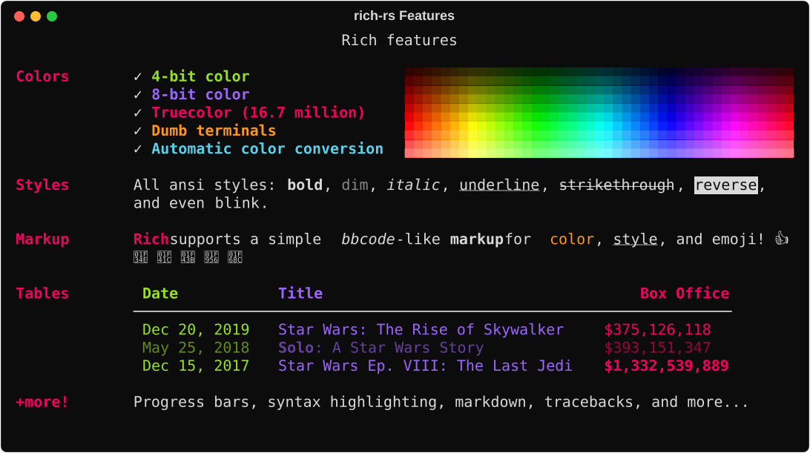
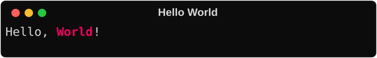
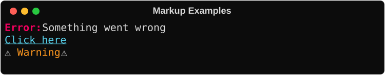
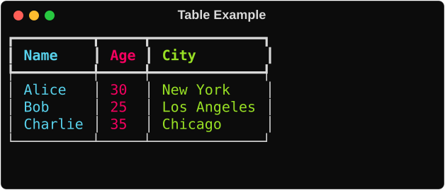
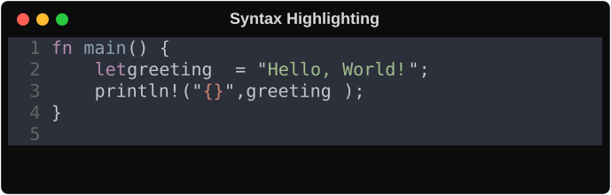
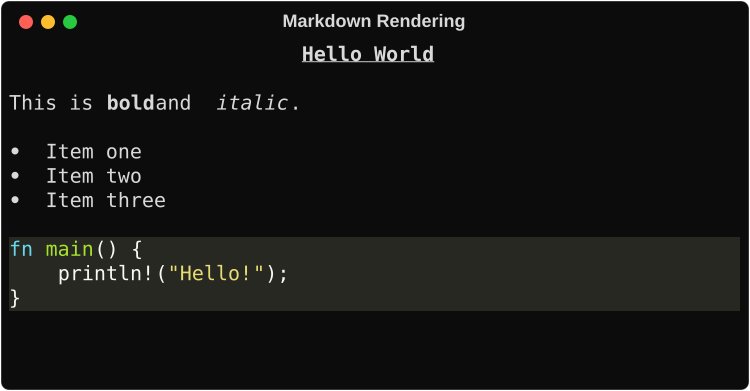
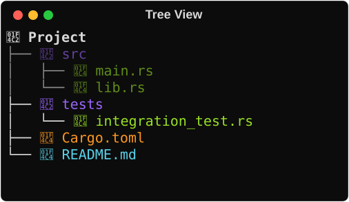
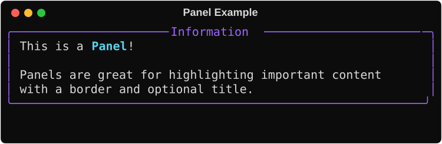
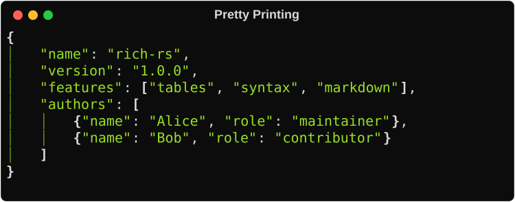
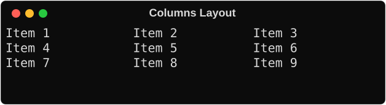

# rich-rs

[](https://crates.io/crates/rich-rs)
[](https://docs.rs/rich-rs)
[](https://opensource.org/licenses/MIT)

Rich text and beautiful formatting for the terminal: a Rust port of Python's [Rich](https://github.com/Textualize/rich) library.

rich-rs focuses on expressive terminal output with a small, composable API. It supports tables, progress bars, Markdown, syntax highlighting, tracebacks, and more without extra setup.



## Compatibility

rich-rs works on Linux, macOS, and Windows. True color / emoji works with modern terminals; legacy Windows console is limited to 16 colors.

**Minimum Supported Rust Version:** 1.85+ (Rust 2024 edition)

## Installing

Add to your `Cargo.toml`:

```toml
[dependencies]
rich-rs = "1.0.5"
```

Run the demo to see rich-rs in action:

```sh
cargo run --example demo
```

## Console Printing

To add rich output to your application, create a `Console` and use its print methods:

```rust
use rich_rs::{Console, Text};

let mut console = Console::new();
let text = Text::from_markup("Hello, [bold magenta]World[/]!", false).unwrap();
console.print(&text, None, None, None, false, "\n").unwrap();
```



rich-rs will automatically word-wrap text to fit the terminal width and detect color support.

## Markup

rich-rs uses a BBCode-like markup syntax for inline styling:

```rust
use rich_rs::{Console, Text};

let mut console = Console::new();
console.print(&Text::from_markup("[bold red]Error:[/] Something went wrong", false).unwrap(), None, None, None, false, "\n").unwrap();
console.print(&Text::from_markup("[link=https://example.com]Click here[/link]", false).unwrap(), None, None, None, false, "\n").unwrap();
console.print(&Text::from_markup(":warning: [yellow]Warning[/] :warning:", true).unwrap(), None, None, None, false, "\n").unwrap();
```



# rich-rs Library

rich-rs ships with a set of built-in *renderables* you can combine to produce clean, beautiful CLI output.

Click the headings below for details:

<details>
<summary>Tables</summary>

rich-rs can render flexible tables with unicode box characters, borders, styles, and cell alignment.

```rust
use rich_rs::{Console, Table, Column, Style, SimpleColor, JustifyMethod, Text};

let mut console = Console::new();
let mut table = Table::new();

table.add_column(Column::with_header(Box::new(Text::styled("Name", Style::new().with_color(SimpleColor::Standard(6))))));
table.add_column(Column::with_header(Box::new(Text::styled("Age", Style::new().with_color(SimpleColor::Standard(5))))).justify(JustifyMethod::Right));
table.add_column(Column::with_header(Box::new(Text::styled("City", Style::new().with_color(SimpleColor::Standard(2))))));

table.add_row_strs(&["Alice", "30", "New York"]);
table.add_row_strs(&["Bob", "25", "Los Angeles"]);
table.add_row_strs(&["Charlie", "35", "Chicago"]);

console.print(&table, None, None, None, false, "\n").unwrap();
```



Tables automatically resize columns to fit the terminal width, wrapping text as needed.

</details>

<details>
<summary>Progress Bars</summary>

rich-rs can render multiple flicker-free progress bars to track long-running tasks.

```rust
use std::thread::sleep;
use std::time::Duration;
use rich_rs::{LiveOptions, Progress, TrackConfig};

let mut progress = Progress::new_default(LiveOptions::default(), false, false, false);
progress.start().unwrap();

let config = TrackConfig {
    total: None,
    completed: 0.0,
    task_id: None,
    description: "Working...".to_string(),
    update_period: Duration::from_millis(100),
};

for _ in progress.track_sequence(0..100, config) {
    sleep(Duration::from_millis(25));
}

progress.stop().unwrap();
```

For lower-level control, use `add_task(...)`, `update(...)`, and custom columns via `Progress::new(...)`.

The progress API also supports `print(...)` and `log(...)` while the display is active.

For a full runnable example: `cargo run --example progress`.

</details>

<details>
<summary>Live Display</summary>

rich-rs can update content in-place for real-time displays.

```rust
use rich_rs::{Live, Text};
use std::time::Duration;

let mut live = Live::new(Box::new(Text::plain("Count: 0")));

live.start(true).unwrap();
for i in 0..10 {
    live.update(Box::new(Text::plain(&format!("Count: {}", i))), true).unwrap();
    std::thread::sleep(Duration::from_millis(500));
}
live.stop().unwrap();
```

Live display supports transient mode (clears on exit), alt-screen mode, and vertical overflow handling.

</details>

<details>
<summary>Logging Adapters</summary>

rich-rs provides logging adapters in a companion crate:

- `rich-tracing::RichTracingLayer` for `tracing_subscriber`
- `rich-tracing::RichLogger` for the `log` crate ecosystem

See `crates/rich-tracing/README.md` and `crates/rich-tracing/examples/tracing_basic.rs` for usage.

</details>

<details>
<summary>Syntax Highlighting</summary>

rich-rs uses [syntect](https://github.com/trishume/syntect) to implement syntax highlighting with multiple themes.

```rust
use rich_rs::{Console, Syntax};

let mut console = Console::new();

let code = r#"fn main() {
    let greeting = "Hello, World!";
    println!("{}", greeting);
}
"#;

let syntax = Syntax::new(code, "rust")
    .with_line_numbers(true)
    .with_theme("base16-ocean.dark");

console.print(&syntax, None, None, None, false, "\n").unwrap();
```



Available themes include `base16-ocean.dark`, `Solarized (dark)`, `InspiredGitHub`, and more.

</details>

<details>
<summary>Markdown</summary>

rich-rs can render markdown with syntax-highlighted code blocks.

```rust
use rich_rs::{Console, markdown::Markdown};

let mut console = Console::new();

let md = r#"# Hello World

This is **bold** and *italic*.

- Item one
- Item two

```rust
fn main() {
    println!("Hello!");
}
```
"#;

let markdown = Markdown::new(md);
console.print(&markdown, None, None, None, false, "\n").unwrap();
```



Supports CommonMark + GitHub Flavored Markdown including tables, task lists, and fenced code blocks.

</details>

<details>
<summary>Trees</summary>

rich-rs can render hierarchical data with guide lines.

```rust
use rich_rs::{Console, Style, Text, Tree, TreeNodeOptions};

let mut console = Console::new();

let mut tree = Tree::new(Box::new(Text::from_markup("[bold]:open_file_folder: Project[/]", true).unwrap()));
let src = tree.add_with_options(
    Box::new(Text::from_markup("[blue]:open_file_folder: src[/]", true).unwrap()),
    TreeNodeOptions::new()
        .with_style(Style::parse("dim").unwrap_or_default())
        .with_guide_style(Style::parse("dim").unwrap_or_default()),
);
src.add(Box::new(Text::from_markup("[green]:page_facing_up: main.rs[/]", true).unwrap()));
src.add(Box::new(Text::from_markup("[green]:page_facing_up: lib.rs[/]", true).unwrap()));
tree.add(Box::new(Text::from_markup("[yellow]:page_facing_up: Cargo.toml[/]", true).unwrap()));

console.print(&tree, None, None, None, false, "\n").unwrap();
```



</details>

<details>
<summary>Panels</summary>

rich-rs can render content in bordered boxes with titles.

```rust
use rich_rs::{Console, Panel, Text, Style, SimpleColor};
use rich_rs::r#box::ROUNDED;

let mut console = Console::new();

let content = Text::from_markup(
    "This is a [bold cyan]Panel[/]!\n\nPanels are great for highlighting important content.",
    true
).unwrap();

let panel = Panel::new(Box::new(content))
    .with_title("Information")
    .with_box(ROUNDED)
    .with_border_style(Style::new().with_color(SimpleColor::Standard(4)));

console.print(&panel, None, None, None, false, "\n").unwrap();
```



</details>

<details>
<summary>Tracebacks</summary>

rich-rs can render beautiful panic backtraces with syntax-highlighted source context.

```rust
use rich_rs::traceback;

// Install as the default panic handler
traceback::install();

// Now panics will show beautiful tracebacks
```

Tracebacks show the call stack with source code snippets and local variable values.

</details>

<details>
<summary>Pretty Printing</summary>

rich-rs can pretty-print data structures with syntax highlighting.

```rust
use rich_rs::{Console, Pretty};

let mut console = Console::new();

let data = r#"{"name": "rich-rs", "version": "1.0.0", "features": ["tables", "syntax"]}"#;
let pretty = Pretty::from_str(data).with_indent_guides(true);

console.print(&pretty, None, None, None, false, "\n").unwrap();
```



</details>

<details>
<summary>Prompts</summary>

rich-rs provides interactive prompts with validation and choices.

```rust
use rich_rs::prompt::{Prompt, Confirm, IntPrompt};

// Text prompt with choices
let color = Prompt::new("Favorite color?")
    .with_choices(&["red", "green", "blue"])
    .run()?;

// Numeric input
let age: i64 = IntPrompt::ask("How old are you?")?;

// Yes/No confirmation
if Confirm::ask("Continue?")? {
    println!("Proceeding...");
}
```

Supports password input, default values, and custom validation.

</details>

<details>
<summary>Columns</summary>

rich-rs can render content in neat columns with equal or optimal width.

```rust
use rich_rs::{Console, Columns, Text, Style, SimpleColor, Renderable};

let mut console = Console::new();

let items: Vec<Box<dyn Renderable + Send + Sync>> = (1..=9)
    .map(|i| {
        let color = SimpleColor::Standard((i % 7 + 1) as u8);
        Box::new(Text::styled(&format!("Item {}", i), Style::new().with_color(color)))
            as Box<dyn Renderable + Send + Sync>
    })
    .collect();

let columns = Columns::new(items).with_equal(true);
console.print(&columns, None, None, None, false, "\n").unwrap();
```



</details>

## Acknowledgments

- [Textualize](https://github.com/Textualize) for creating the original Python Rich library
- [syntect](https://github.com/trishume/syntect) for syntax highlighting
- [crossterm](https://github.com/crossterm-rs/crossterm) for cross-platform terminal support
- [pulldown-cmark](https://github.com/raphlinus/pulldown-cmark) for Markdown parsing

## License

MIT License — see [LICENSE](LICENSE) for details.
